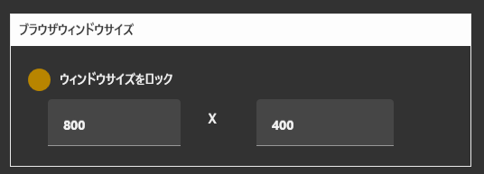
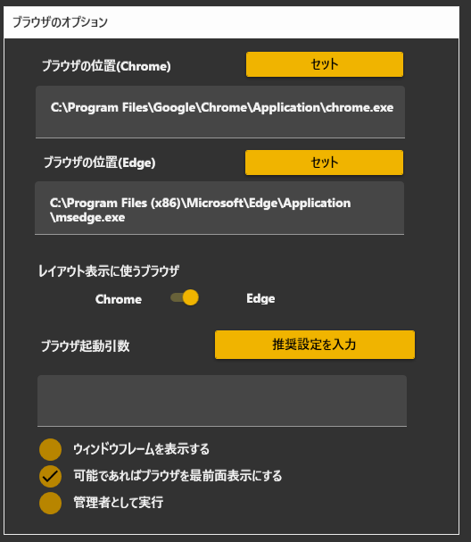
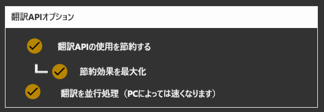
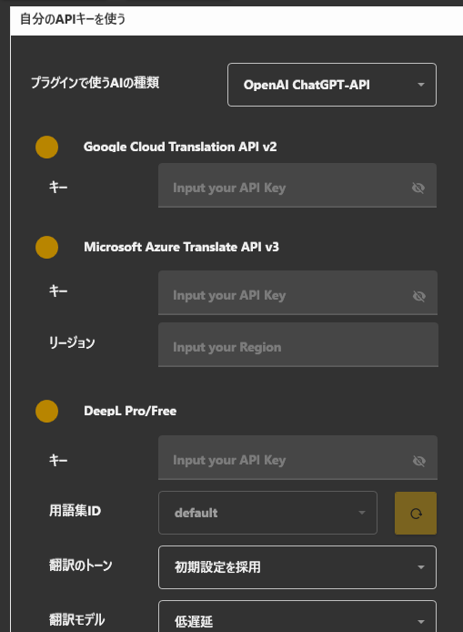
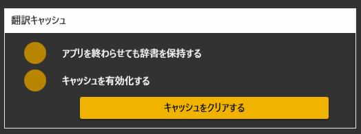
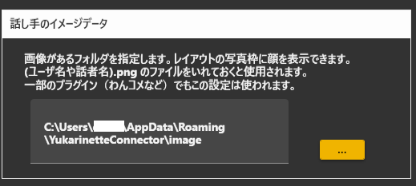
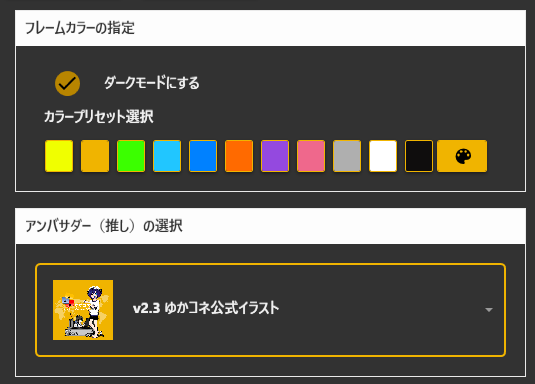
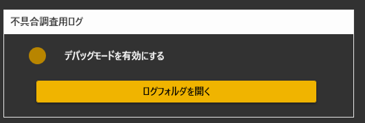

# オプション設定項目

<!-- version-banner -->
!!! info ""
    ゆかコネNEO **v3.0** のドキュメントです。v2.3 をお使いの方は [v2.3 版のこのページ](../../v2.3/startup/startup_option.md) を、違いを知りたい方は [v2.3 から v3.0 への移行](../../mig/mig_neo_v3.0.md) をご覧ください。

オプション設定は、左メニューの**オプション設定**グループにある5つの画面に分かれています。このページも同じ順番で説明します。

!!! tip "項目が見つからないとき"
    左メニューの **「設定をさがす」** に項目名を入れて **Enter** を押すと、その設定まで画面が移動します。
    上のタブの **「ホーム」→「すべての設定」**（左メニューでは先頭の **「全ての設定画面を表示」**）で、すべての項目を 1 画面に並べることもできます。

|画面|主な内容|
|:--|:--|
|ブラウザのオプション|字幕表示に使うブラウザとウィンドウサイズ|
|翻訳（API、設定）|翻訳の節約設定・自分のAPIキー・翻訳キャッシュ。APIキーは「APIキーの設定」画面に分かれています|
|ネットワークの設定|通信の許可範囲と使うネットワーク|
|フォルダの指定|話し手の絵や外部ツールの場所|
|起動時設定|見た目のテーマ・スタートアップ登録・調査用ログ|

## ブラウザのオプション

### ブラウザウインドウサイズ

* 字幕を表示するウィンドウのサイズを強制的にロックします。
* OBSなどに取り込む際、数字でサイズを決めたい方に向いています。

|項目|意味|既定|
|:--|:--|:--|
|幅|字幕ウィンドウの横幅|800|
|高さ|字幕ウィンドウの高さ|400|
|ウィンドウサイズをロック|指定したサイズに固定します|OFF|

### 表示に使うブラウザの設定

<!-- TODO: スクリーンショットは v2.3.59 時点のもの。項目が増えているため撮り直しが必要 -->

* 字幕を表示するために使うブラウザの動作を変更できます。
* ChromeとEdgeのどちらを使うかを設定できます。（既定はEdge）

|オプション|機能|既定|
|:--------|:---|:--|
|Chrome / Edge|字幕表示に使うブラウザを選びます|Edge|
|ブラウザの位置(Chrome) / (Edge)|ブラウザの実行ファイルの場所です。自動で見つからない場合に指定します|自動|
|ブラウザ引数|ブラウザの動作を切り替えます。 例えば --incognito をいれると、シークレットモードで起動します。 「推奨設定を入力」ボタンで、おすすめの内容を入れられます|—|
|ウィンドウフレームを表示する|字幕ウィンドウに枠とタイトルバーを出します|OFF|
|可能であればブラウザを最前面表示にする|字幕ウィンドウをほかのウィンドウの手前に出します|ON|
|管理者として実行|ブラウザなどを管理者権限で起動します|OFF|

!!! Warning "音声認識に使うブラウザとは別の設定です"
    * ここで選ぶのは**字幕の表示**に使うブラウザです。
    * **音声認識**にChromeとEdgeのどちらを使うかは、「音声入力の設定」画面で選びます。混同しやすいのでご注意ください。

## 翻訳（API、設定）

### 翻訳APIオプション

<!-- TODO: スクリーンショットは v2.3.59 時点のもの。ラベルの文言が変わっているため撮り直しが必要 -->

翻訳に関する動作を変更できます。翻訳エンジンの呼び出し回数を減らして、費用や制限を節約するための設定です。

|オプション|機能|既定|
|:--------|:---|:--|
|翻訳を節約（発話途中の翻訳間隔を伸ばす）|ON：翻訳途中の翻訳間隔を減らします。 OFF: 認識途中でも翻訳を実行します|ON|
|効果を最大化（発話途中で翻訳しない）|ON:文章確定時のみ翻訳します OFF:翻訳途中の翻訳間隔をさらに減らします。|ON|
|翻訳を並行処理（PCによっては速くなります）|複数言語の翻訳を同時に翻訳します。 PCや回線に余力がない場合はチェックを外した方が安定します。|ON|

### 自分のAPIキーを使う

<!-- TODO: スクリーンショットは v2.3.59 時点のもの。モデル選択とParapperのポート欄が増えているため撮り直しが必要 -->

* 自分で契約したAPIキーを使うことができます。
* 使いたい翻訳エンジンが決まったら、当該エンジン提供メーカーと契約を行い、キーを入手してください。
* 入手したキーを設定しチェックをONにすると、指定した翻訳エンジンを個人のAPIキーを用いて動かせるようになります。

エンジンごとに、キー以外の設定もここで行います。

|エンジン|設定できること|
|:--|:--|
|Google|APIキー|
|Microsoft|APIキー、Azureのリージョン（例: japaneast）|
|DeepL|APIキー、用語集ID（「再取得」ボタンで一覧を取り込めます）、翻訳のトーン（初期設定を採用／よりフォーマルに／よりカジュアルに）、翻訳モデル（低遅延／品質を優先）|
|OpenAI|APIキー、使用するモデルの選択|
|Google Gemini|APIキー、使用するモデルの選択（2.5 Flash / 2.5 Flash Lite / 2.5 Pro / 3.1 Pro / 3.1 Flash Lite / 3.5 Flash / 3.5 Flash Lite / 3.6 Flash / 3.7 Flash / 3.8 Flash）|
|Anthropic Claude|APIキー、使用するモデルの選択|
|OpenRouter|APIキー、使用するモデルの選択|
|Grok|APIキー、使用するモデルの選択|
|NAVER Papago|APIキー、クライアントID|
|Tencent|SecretID、SecretKey、リージョン|
|Baidu|APPID、SecretKey|
|Alibaba|APPID、SecretKey|
|PLaMo|APIキー、使用するモデル（既定: plamo-3.0-prime）。利用条件の確認チェック（後述）|
|みらい翻訳|接続先（Host）、APIキー、プロファイル、言語コードの読み替え。利用条件の確認チェック（後述）|
|みんなの自動翻訳＠TexTra|ログインID、API key、API secret、自動翻訳の種類（既定: generalNT）。利用条件の確認チェック（後述）|
|Google Apps Script|公開したスクリプトのURL（[GASの設定](startup_gas.md) を参照）|
|ローカル翻訳|接続先URL、通信の形式（POST(form) / POST(JSON) / OpenAI Format / plamo-2-translate）、モデル名|
|Parapper翻訳|ポート番号（後述）|
|Jev (TypeSafe)|APIキー、使用するモデル（既定: jev-latest）。翻訳には使いません（後述）|

!!! warning "廃止されたモデルを選んでいた場合"
    提供が終わったモデルを選んでいると、翻訳時に 404 になります。
    ゆかコネNEO は起動時に**自動で近いモデルへ読み替えます**が、
    読み替えたときはお知らせが出るので、意図と違っていれば選び直してください。

!!! Info "v2.3 から移行した方へ"
    * **Gemini Flash Lite** は、選択肢の名前は同じまま、実際に呼ぶモデルが
      2.5 Flash Lite → 3.5 Flash Lite に変わっています。
    * **Alibaba 翻訳**は v2.3 では中身が動いていませんでした。v3.0 で実際に呼び出すようになったので、
      SecretId / SecretKey を入れていないと翻訳されません。
    * **Claude / OpenRouter** は、v2.3 初期の既定値の取り違えで API キー欄にモデル名が入っていることがあります。
      「v2.3設定を移行」が自動で直します。

### プラグインで使うAIの種類

* プラグイン（AIアシスタントなど）が使うAIを選びます。
* 選択肢は OpenAI ChatGPT-API / Claude API / OpenAPI / Google Gemini / Browser内蔵LLM(無料) です。
* ここで選んだAIのAPIキーが、上の「自分のAPIキーを使う」で設定されている必要があります。

### Parapper翻訳

!!! Tech "使用条件"
    * ゆかコネNEO v2.3.128～

* Parapper は、お使いのPCの中で動くローカル翻訳です。APIキーの契約は不要で、翻訳の通信が外に出ません。
* 設定欄は「自分のAPIキーを使う」グループのいちばん下にあります。
* 接続先・通信の形式・モデル名は自動で決まるため、**設定するのはポート番号だけ**です。

|設定|意味|
|:--|:---|
|Port|Parapper が待ち受けているポート番号です。既定は ``18081`` （1～65535）|

* 数字でない値や範囲外の値を入れた場合は、いまの値をそのまま保持します。
* 設定したら、翻訳エンジンの一覧から ``Parapper翻訳`` を選ぶと使えるようになります。

!!! Info "Parapper 本体を起動しておいてください"
    * ゆかコネNEO側は、すでに動いている Parapper へ接続しにいくだけです。
    * Parapper が起動していない、またはポートが違う場合は翻訳されません。

### PLaMo翻訳・みらい翻訳・みんなの自動翻訳＠TexTra { #user-key-engines }

!!! Tech "使用条件"
    * ゆかコネNEO v3.0.0 beta 37～

* どれも**自分で用意したAPIキー**で使う翻訳エンジンです。キーは各サービスと自分で契約して入手してください。
* 設定欄は「自分のAPIキーを使う」グループの中、Grok の下にあります。上のタブでは **「音声と翻訳」→「APIキーの設定」** から開けます。
* 各欄の見出しの下に、そのサービスの**利用条件**が表示されます。読んで当てはまることを確かめたら、**確認のチェックを ON** にしてください。
* チェックが OFF のあいだは、翻訳エンジンの一覧で選べず（灰色になります）、選んであっても翻訳を送りません（ほかのエンジンでの翻訳に回ります）。

!!! warning "利用条件はサービスごとに大きく違います"
    下の表は 2026年10月時点の各社の規約から、配信で使うときに関係するところを抜き出したものです。
    使う前に、必ず各サービスの規約そのものを確認してください。

|エンジン|主な利用条件|
|:--|:--|
|PLaMo（Preferred Networks）|登録できるのは **18歳以上で日本国内の居住者（または法人）**。APIキーの共有は禁止。無償枠では入力がモデルの開発に使われることがある。**政治活動での利用は PFN の許諾が必要**|
|みらい翻訳|APIキーの使い道は**契約プランで決まります**（ワード数定額プランは翻訳支援ツール専用、ほかは別途の特約による）。**配信の字幕に使えるかは、みらい翻訳に確認してください**。APIキーの共有は禁止。利用は日本国内が原則|
|みんなの自動翻訳＠TexTra（NICT）|**非商用での利用に限られます**。広告・投げ銭・企業案件などで収益を得る配信は商用にあたるおそれがあり、個人向けの商用契約はありません。送った文は NICT のサーバに記録され、研究に使われることがあるため、**個人情報や視聴者のコメントは送らないでください**。翻訳結果には「Powered by NICT」の表示が必要です|

#### PLaMo翻訳

|設定|意味|
|:--|:---|
|Key|PLaMo の APIキー（[PLaMo API](https://plamo.preferredai.jp/) で発行）。入力は伏せ字で表示されます|
|Model|使うモデル。既定は ``plamo-3.0-prime``（一覧にない名前を直接入れることもできます）|

* 「やさしい日本語」「ひらがな」などの特別な翻訳先にも対応しています。

#### みらい翻訳

|設定|意味|
|:--|:---|
|Host|接続先のサーバ名（例: ``xxxx.miraitranslate.com``）。``https://`` 付きで貼っても受け付けます|
|Key|APIキー（X-Subscription-Key）。入力は伏せ字で表示されます|
|Profile|プロファイル。空欄なら ``default``|
|Lang map|言語コードの読み替え。言語コードが違うときだけ ``元=先`` をカンマ区切りで書きます（例: ``zh-CN=zh, zh-TW=zh-TW``）|

* 接続先・プロファイル・言語コードは、契約時にみらい翻訳から届く「サーバ接続情報」に書かれています。
* みらい翻訳は原文の言語の指定が必須です。話した言語が判定できないときは、母国語として送ります。

#### みんなの自動翻訳＠TexTra

|設定|意味|
|:--|:---|
|Login ID|みんなの自動翻訳＠TexTra のログインID|
|Key（API key）|API key。入力は伏せ字で表示されます|
|API secret|API secret。入力は伏せ字で表示されます|
|Engine|使う自動翻訳の種類。既定は ``generalNT``（汎用NT）|

* ログインID・API key・API secret は、[みんなの自動翻訳＠TexTra](https://mt-auto-minhon-mlt.ucri.jgn-x.jp/) のアカウントで発行されます。
* 確認のチェックの上に、NICT の「利用者向け制限事項」と「免責事項」が表示されます。チェックを ON にすると、これに同意したことになります。
* 汎用NT が対応していない言語の組では翻訳されません。

### Jev { #jev }

!!! Tech "使用条件"
    * ゆかコネNEO v3.0.0 beta 24～

* Jev (TypeSafe) は、文章を作らずに、問いへの答えを数値（点数や選択肢）で返す**判定専用の AI** です。
* 翻訳には使いません。いまは [読み上げ連携](../plugin/plugin_playvoice.md) の「パラメータを Jev に調整させる」が使います。
* 設定欄は「自分のAPIキーを使う」グループのいちばん下、Parapper翻訳の下にあります。

|設定|意味|
|:--|:---|
|API Key|Jev の API キー。入力は伏せ字で表示されます|
|MODEL|使うモデル。既定は ``jev-latest``（一覧にない名前を直接入れることもできます）|

!!! Info "キーはプラグインへ渡りません"
    * キーは本体だけが持ち、暗号化して保存します。
    * プラグインは本体に判定を頼むだけで、キーそのものは受け取りません。プラグインの設定画面にキーを入れる欄が無いのはこのためです。

### 翻訳キャッシュ

|オプション|機能|
|:--------|:---|
|キャッシュを有効化|以前の翻訳結果を記憶し、同じ文を翻訳するときに前回の結果を活用します|
|アプリを終わらせても辞書を保持|アプリ再起動しても前回の翻訳結果を活用します|
|キャッシュをクリア|記憶したデータをクリアします。|

## ネットワークの設定

* ゆかコネNEOの通信に関する設定です。
* 外部ツールとの連携がうまくいかないときや、ほかのパソコンから字幕を見たいときに触ります。

|オプション|機能|既定|
|:--------|:---|:--|
|同時通信量を節約する|同時に行う通信を減らします。回線が細い環境で安定させたいときに使います|OFF|
|すべてのIPアドレスを有効にする(管理者として起動が必要）|ほかのパソコンやスマホからの接続を受け付けます|OFF|
|使うネットワークの指定|パソコンに複数のネットワークがある場合、どれを使うか選びます|自動|

### API・Webサーバ設定

|オプション|機能|
|:--------|:---|
|Web許可ホスト|接続を許可するアドレスを、1行に1つずつ書きます（前方一致）|
|使える通信ポートを自動で選びます|ポートが使われていた場合に別のポートを自動で探します（既定ON）|

!!! Warning "「すべてのIPアドレスを有効にする」について"
    * ゆかコネNEOのAPIには**認証がありません**。接続元のアドレスだけで判断しています。
    * このチェックをONにすると、同じネットワークにいる人が誰でもAPIを呼び出せる状態になります。ネットカフェや共有Wi-Fiなど、信頼できないネットワークではONにしないでください。
    * ONにしても、**管理者としてゆかコネNEOを起動していない場合は有効になりません**（同じパソコンの中だけの通信に戻ります）。
    * 許可されるのは、同じパソコン・プライベートIPアドレス（``10.`` ``192.168.`` ``172.16``～``172.31`` で始まるもの）・Web許可ホストに書いたアドレスです。
    * 詳しくは [本体内蔵API](../tech/tech_api_neo.md) の「アクセス制御について」をご覧ください。

!!! Info "「使える通信ポートを自動で選びます」について"
    * OFFにすると、通信ポートが ``11900`` / ``11901`` に固定されます。外部ツールとの連携でポート番号を固定したいときに使います。
    * ONのままでも、実際に使われている番号はレジストリから取得できます。詳しくは [本体内蔵API](../tech/tech_api_neo.md) の「通信ポートについて」をご覧ください。

## フォルダの指定

* 外部のファイルやツールの場所を指定します。

### 話し手のイメージデータ { #talker-image }

* トークセッションなど、話し手の絵を使うシチュエーションで読み込まれる絵を置きます。
* ファイル名は、``（話者名）.png `` にします。
* ファイルサイズは、``100 x 100`` 程度の正方形にします。 

### 外部の音声認識ツールの場所

* 音声認識に外部ツールを選んだ場合は、その場所をここで指定します。

|項目|意味|既定|
|:--|:--|:--|
|Whisperの実行ファイル|Whisperを起動するバッチファイルの場所|—|
|ゆーかねすぴれこ|ランチャーで作ったバッチファイルの場所|—|
|Parapper がある場所|Parapperをインストールしたフォルダ|``C:\Program Files\Parapper``|

!!! Info "Parapper の2つの設定について"
    * ここで指定するのは**音声認識**に使う Parapper の場所です。
    * **翻訳**に使う Parapper のポート番号は「翻訳（API、設定）」画面にあります。別の設定です。

### 自動バックアップ

* 設定を自動的にバックアップします。設定がおかしくなったときに戻せるようになります。

|項目|意味|既定|
|:--|:--|:--|
|バックアップ機能を有効にする|設定の自動バックアップを行います|ON|
|保存先|バックアップを置くフォルダ|既定の設定フォルダ内|

* 復元は「設定保存・復元」画面の「バックアップから復元」で行います。詳しくは [設定の保存・復元とプロファイル](startup_profile.md) をご覧ください。

## 起動時設定

### アンバサダーの設定

* ゆかコネのアンバサダーと公式担当が合計１０名います。
* こちらを設定することで推し設定することができます。

!!! Tip "推し設定について"
    この設定をしても、ゆかコネNEOのメイン動作は何も変わりません。
    見た目がちょっと変わって、Happyになれるという機能です。

### 画面の見た目

|オプション|機能|既定|
|:--------|:---|:--|
|ダークモードにする|ゆかコネNEOの画面を暗い配色にします|ON|
|フレームカラーの指定|画面のアクセントカラーを選びます。プリセット11色・Windows のアクセントカラーに合わせる（窓の印のボタン）・自分で色を作る、から選べます。Windows に合わせると、あとで Windows 側の色を変えたときも追いかけます|Windows のアクセントカラーに合わせる（v3.0.0 beta 37～。それより前に自分で色を選んでいた方はその色のまま）|
|UIの点滅効果を止める|画面のアニメーションや点滅を止めます。目が疲れる場合や、画面を録画する場合に使います|OFF|

### オプション

|オプション|機能|既定|
|:--------|:---|:--|
|前回のミュート状態を記憶する|音声認識のミュートボタンを再起動しても保持します|ON|
|システムメッセージをOFFにする|「設定を変更しました」を表示しないようにします|OFF|

### スタートアップ登録

|オプション|機能|
|:--------|:---|
|スタートアップ登録を実行|パソコンを起動したときにゆかコネNEOを自動で立ち上げます|
|スタートアップ登録を解除|自動起動をやめます|

* 登録すると、最小化＋常駐の状態で立ち上がります。
* 手動で登録したい場合は、起動オプション ``/startup`` を使います。詳しくは [起動オプション](../tech/tech_option_neo.md) をご覧ください。

### 不具合調査用ログ

* 不具合が発生しているときに、解析を支援するためのデータを得られます。

|オプション|機能|
|:--------|:---|
|デバッグモードを有効にする|内部動作を解析するデータをログに出力するようになります|
|ログフォルダを開く|ログがある場所を開きます|

* 毎回ONにするのが面倒な場合は、起動オプション ``/log`` が使えます。
* 画面の下には、直近に起きたエラーの内容も表示されます。
